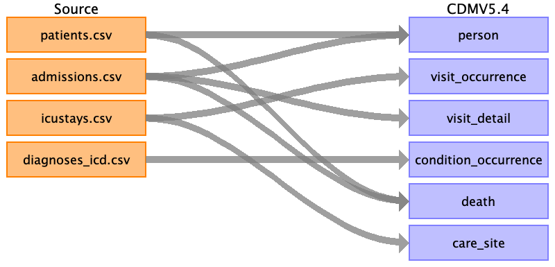

# Source Data Mapping Approach to CDMV5.4

### Source Data

MIMIC-IV was used as the source dataset for this demonstration. The dataset is originally available on Physionet and requires credentials to access the data.

## High level concept mapping using OMOP-CDM

## Mappings

[person](etl_specs/etl/person.md)

[visit_occurrence](etl_specs/etl/visit_occurrence.md)

[visit_detail](etl_specs/etl/visit_detail.md)

[condition_occurrence](etl_specs/etl/condition_occurrence.md)

[death](etl_specs/etl/death.md)

[care_site](etl_specs/etl/care_site.md)

[source_appendix](etl_specs/etl/source_appendix.md)