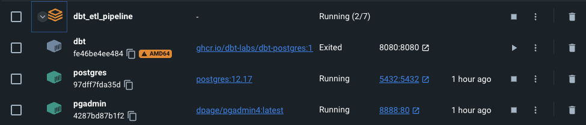
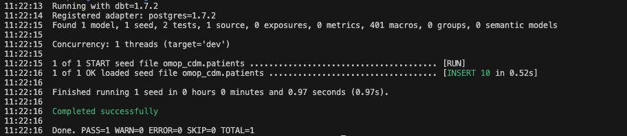
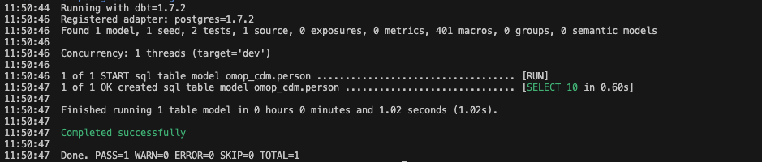

# ETL Pipeline for mapping MIMIC-IV data to OMOP CDM v5.4 using dbt

## Initial Setup

### 1. Install Docker
Follow the simple instructions show in the Docker installation [guide](https://docs.docker.com/engine/install/) depending on your OS.  

### 2. Set up the docker container
 1. First things first, after you have cloned the repo make sure you are in the `dbt_etl_pipeline` folder in your terminal.
    - Use command `cd dbt_etl_pipeline`  
 2. Open the `Makefile`.
    - This contains the series of command that we will execute in the docker container. Using a makefile eases the process of running long commands and makes it easy to remember.  
 3. The first command that you need to run is `make up`
    - This will set up the docker container in your machine. **NOTE: Make sure that the Docker is running in the background**
    - **NOTE: Run this command each time you are working on the project**
 4. After your docker container is set up, you should be able to see 3 containers running in your Docker Dashboard. See example below.  

    

**NOTE: For macOS users, ignore the AMD64 warning.**

 5. The first step is to seed your input tables (structured data) into the schema. The input data is found in the `seed\` directory. This is the place where all your input tables will be kept as the dbt will look for the input data in this directory.  
    - To seed the data, run `make dbt-seed`. You can find this command in the `Makefile`.  
    - After the run is complete, you should get an output like this below  

    

 6. The above message shows that the table has been successfully seeded into the schema `omop_cdm`. In order to check this, execute the below commands to navigate to the table generated and check if everything is in place.
    - To login to the docker shell, run `docker exec -it <container_id> /bin/sh`.  *NOTE: The postgres container id can be copied from the docker desktop application (shown above).*
    - Assuming that you did not change anything in the `profile.yml` you should be able to access the database using the command `psql -U postgres -d etl_test`.  
    - To view the list of schemas, run `\du`. You should see the `omop_cdm` schema in the list.  

    ```
    List of schemas
    Name      |  Owner   
    ----------+----------
    omop_cdm  | postgres
    public    | postgres
    ```
    - Next, run `\dt omop_cdm` command to list all the tables in this schema
    - To view the contents of the table we just seeded, run `SELECT * FROM omop_cdm.patients LIMIT 10;`
    
    ```
    subject_id | gender | anchor_age | anchor_year | anchor_year_group | dod 
    ------------+--------+------------+-------------+-------------------+-----
    10000048 | F      |         23 |        2126 | 2008 - 2010       |    
    10002723 | F      |          0 |        2128 | 2017 - 2019       |    
    10003939 | M      |          0 |        2184 | 2008 - 2010       |    
    10004222 | M      |          0 |        2161 | 2014 - 2016       |    
    10005325 | F      |          0 |        2154 | 2011 - 2013       |    
    10007338 | F      |          0 |        2153 | 2017 - 2019       |    
    10008101 | M      |          0 |        2142 | 2008 - 2010       |    
    10009872 | F      |          0 |        2168 | 2014 - 2016       |    
    10011333 | F      |          0 |        2132 | 2014 - 2016       |    
    10011879 | M      |          0 |        2158 | 2014 - 2016       |    
    (10 rows)
    ```

7. Next, we need to run our models in dbt. We have already prepared the models we need to build.   
   You can find them by navigating to the `models/` directory. 
   - The `schema.yml` contains the conceptual definition of the models you need your input to transformed to. In our case  
   we have created the OMOP CDM v5.4 definition in `YAML` alongwith some tests for validation.  
   - All `.sql` files contain the SQL logic for the transformation of input data in dbt. 
   - The principle to generated these CTEs (Common Table expressions) in SQL are similar to what we did in the RabbitInAHat Tutorial. You can look at the ETL templates in the `etl/sql/` directory. 

   To finally build your models, run `make dbt-run`. You should see a `person` table created in the `omop_cdm` schema.

   

8. Again, in order to check whether the table is correctly built into the database, login to the docker shell and follow the steps mentioned in step 6 above.
    - To view the `person` table, run `SELECT * FROM omop_cdm.person LIMIT 10;`

    ```
     person_id | gender_source_value | gender_concept_id | year_of_birth | month_of_birth | day_of_birth | birth_datetime | race_concept_id | ethnicity_concept_id 
    -----------+---------------------+-------------------+---------------+----------------+--------------+----------------+-----------------+----------------------
    10000048 | F                   |              8532 |          2126 |                |              |                |                 | 
    10002723 | F                   |              8532 |          2128 |                |              |                |                 | 
    10003939 | M                   |              8507 |          2184 |                |              |                |                 | 
    10004222 | M                   |              8507 |          2161 |                |              |                |                 | 
    10005325 | F                   |              8532 |          2154 |                |              |                |                 | 
    10007338 | F                   |              8532 |          2153 |                |              |                |                 | 
    10008101 | M                   |              8507 |          2142 |                |              |                |                 | 
    10009872 | F                   |              8532 |          2168 |                |              |                |                 | 
    10011333 | F                   |              8532 |          2132 |                |              |                |                 | 
    10011879 | M                   |              8507 |          2158 |                |              |                |                 | 
    (10 rows)
    ```

With this you are now familiar with the basic process behind data mapping and transformation using dbt. Advanced Data Validation and Profiling is out of scope for this pipeline. We will include this as a part of the end-to-end ETL pipleine where we combine dbt with Nextflow to perform AutoQC at ingestion and validation of data.  

For more information on dbt checkout the resources below: 

### Resources:
- Learn more about dbt [in the docs](https://docs.getdbt.com/docs/introduction)
- Check out [Discourse](https://discourse.getdbt.com/) for commonly asked questions and answers
- Join the [chat](https://community.getdbt.com/) on Slack for live discussions and support
- Find [dbt events](https://events.getdbt.com) near you
- Check out [the blog](https://blog.getdbt.com/) for the latest news on dbt's development and best practices
