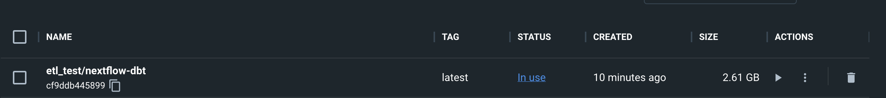
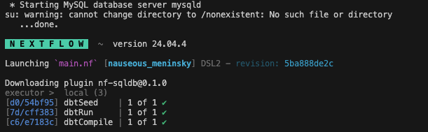

# ETL Pipeline for mapping MIMIC-IV data to OMOP CDM v5.4 using dbt and Nextflow

## Initial Setup

In this workflow, you will map raw EHR data to OMOP common data model using the data transformation workflow with dbt. I have attached some resources below to help you understand the basics of dbt.

To achieve this, you will have to setup a docker container on your local machine NOTE: **opearting system is not a dependency**

This workflow will use 3 pieces of software

1. Nextflow : For pipeline orchestration
2. dbt : For data transformation
3. mysql : Database for storage

Please follow the instructions below to set up the docker container.

### 1. Install Docker
Follow the simple instructions show in the Docker installation [guide](https://docs.docker.com/engine/install/) depending on your OS.

### 2. Set up the docker container
 1. First things first, after you have cloned this repo (using `git clone`) make sure you are in the `etl` folder in your terminal.
    - Use command `cd etl`
 2. After making sure that docker deamon is running in the background, run command `docker build -t etl_test/nextflow-dbt:latest .`
    - This will build the docker image with nextflow, dbt and mysql in it. 
 3. Once the build is complete, you should the image in your docker dashboard as shown below.

    

### 3. Run the docker image
 1. After the docker is setup, run the docker image using the command `docker run --rm etl_test/nextflow-dbt`.  
      - This will initiate the execution of two commands: `service mysql start` and `nextflow run main.nf`
      - The first command will start the mysql service which is responsible for building our schema.
      - The second command will initiate a simple nextflow pipeline which will perform the data transformation of input EHR data using dbt.

      Upon successful execution you should see the following log

      
 

### Resources:
- Learn more about dbt [in the docs](https://docs.getdbt.com/docs/introduction)
- Check out [Discourse](https://discourse.getdbt.com/) for commonly asked questions and answers
- Check out [the blog](https://blog.getdbt.com/) for the latest news on dbt's development and best practices
