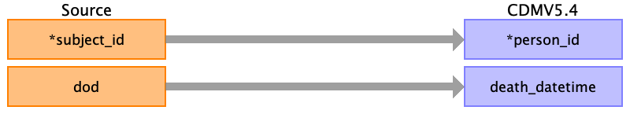

## Table name: death

### Reading from admissions.csv

| Destination Field | Source field | Logic | Comment field |
| --- | --- | --- | --- |
| person_id | subject_id |  |  |
| death_date |  |  |  |
| death_datetime | deathtime |  |  |
| death_type_concept_id |  |  |  |
| cause_concept_id |  |  |  |
| cause_source_value |  |  |  |
| cause_source_concept_id |  |  |  |

### Reading from patients.csv

| Destination Field | Source field | Logic | Comment field |
| --- | --- | --- | --- |
| person_id | subject_id |  |  |
| death_date |  |  |  |
| death_datetime | dod |  |  |
| death_type_concept_id |  |  |  |
| cause_concept_id |  |  |  |
| cause_source_value |  |  |  |
| cause_source_concept_id |  |  |  |

